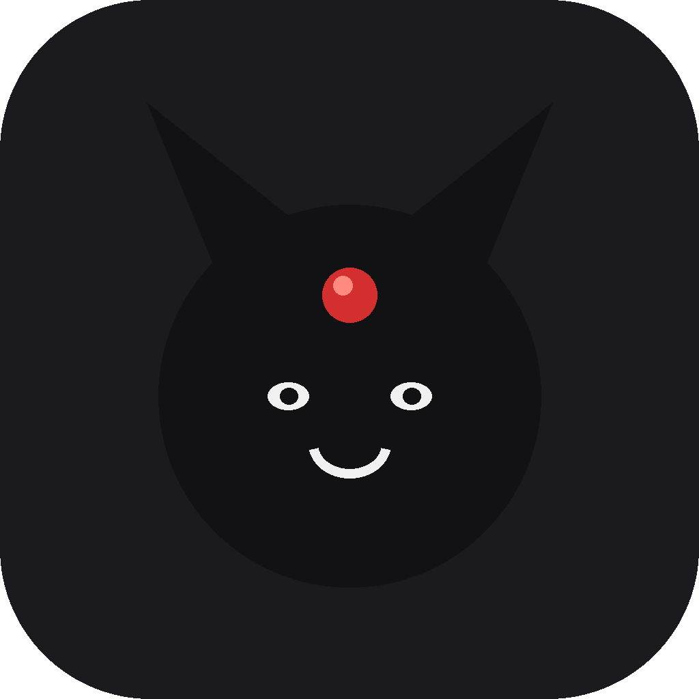

[🇪🇸 Español](README.md)

<div align="center">
  <br/>
  

# Mokona

**モコナ · An ad-free Pixiv viewer that shows every work in its real proportion.**

<br/>


<br/>

[](https://github.com/Chidaruma696/Mokona/releases/latest)

<br/>

*No ads · no tracking · Material You · AMOLED black · R-18 off by default · in English and Spanish*

</div>

---

> [!IMPORTANT]
> **Mokona hosts and distributes no images.** It reads the same API as the official Pixiv app, with your own account, and shows what Pixiv shows you. Every work belongs to its artist. If you like what you see, follow, bookmark and support them on Pixiv.

<br/>

## 📲 Download

1. Open the [latest release](https://github.com/Chidaruma696/Mokona/releases/latest) and grab `Mokona-x.y.z.apk`.
2. Open it on your phone. Android will ask once for permission to install apps from this source.
3. Sign in with your Pixiv account. The login page opens in the device browser; your password never goes through the app.

Mokona is not on the Play Store and never will be; it is distributed only from here. As long as Android stays open, that is enough ([why it matters](#-keep-android-open)).

<br/>

## 🗺️ What it is

Mokona is an Android app to see Pixiv the way it should look. The official app crops every thumbnail to a square, so a tall illustration and a wide one look the same until you open them. Mokona uses the real width and height the API returns and builds a **staggered grid**: tall stays tall, wide stays wide, nothing is cropped.

| 🖼️ See | 🔍 Find | 🎨 Live |
| --- | --- | --- |
| Home with your account's recommendations and new works from who you follow | Daily, weekly, monthly rankings, by audience, originals and rookies, for any date | Material You: the palette comes from your wallpaper (Android 12+) |
| Staggered grid with every work's real proportion, 1 to 4 columns; pull down to refresh | Work search in two sections, **Newest** and **Popular**, with autocomplete, sort, match and date filters; tags show in your language with the original Japanese name underneath, and searching in English or Spanish finds the Japanese tag; or artist search | Light, dark or system theme, plus **AMOLED black** for OLED screens |
| Detail with every page, full-screen viewer with zoom, animated ugoira that **downloads as an MP4 video**, translated tags, related works, comments, original download, share and set as wallpaper | Every artist's profile with a follow button, their works, manga, bookmarks and who they follow | R-18 content **off by default**, switchable in Settings › Content |
| **Comic reader** for multi-page works: vertical strip or page by page right to left, with zoom; recommended manga on Home, manga rankings and series with every chapter |
| Bookmarks tab: public, private, filtered by tag, plus your browsing history | Public bookmark with a tap, private with a long press, synced with your account | English or Spanish: asked on first start (English if skipped), changeable in Settings; pixiv.net links open in Mokona |

<br/>

## 🔞 Adult content

Pixiv marks each work as all-ages, R-18 or R-18G. Mokona starts with that content **hidden everywhere**: Home, ranking (the R-18 modes are not even listed), search and related works. The switch lives in Settings › Content and on the first-start screen. What Pixiv shows with the switch on also depends on your own account settings.

<br/>

## 🎨 Material You and AMOLED

Mokona uses Material 3 as it comes: dynamic colors taken from the wallpaper on Android 12 and newer, and its own palette (Mokona black with the red jewel) on older versions or when dynamic color is off. **AMOLED black** replaces every surface of the dark theme with pure black, so OLED screens switch those pixels off and the illustration is the only thing lit.

<br/>

## 🔐 Account and privacy

- Pixiv's API only answers to signed-in users, so an account is required.
- Login is the Pixiv app's own (OAuth with PKCE): Mokona opens the official page in the device browser (a Chrome tab, with its password manager and protections) and only receives the code back. **It never sees your password.**
- Tokens live in the app's private storage and refresh themselves.
- Mokona has no ads, no analytics, no trackers, and talks to nobody but Pixiv.

<br/>

## 🛠️ Build

You need the Android SDK (API 36) and JDK 17 or newer.

```
git clone https://github.com/Chidaruma696/Mokona.git
cd Mokona
./gradlew :app:assembleDebug
```

For the signed build, create `local.properties` with `keystore.file`, `keystore.password`, `keystore.alias` and `keystore.keyPassword`, then run `./gradlew :app:assembleRelease`.

<br/>

## 🧩 Code

- `app/src/main/kotlin/com/mokona/app/data`: API models, OkHttp client with the official app's headers, PKCE login.
- `app/src/main/kotlin/com/mokona/app/ui`: Material You and AMOLED theme, preferences, ViewModels.
- `app/src/main/kotlin/com/mokona/app/ui/screens`: Home, Ranking, Search, Detail, Settings, Login and first start.

All Kotlin and Jetpack Compose, no navigation library: an in-memory screen stack and the back button.

<br/>

## 📜 Credits and license

Mokona is released under the [Apache 2.0 license](LICENSE). Third-party libraries and their licenses are listed in [THIRD_PARTY_NOTICES.md](THIRD_PARTY_NOTICES.md).

- **Pixiv** and its services belong to pixiv Inc. Mokona is an independent viewer with no affiliation or endorsement. Every work belongs to its artist.
- The documentation of Pixiv's app API comes from [pixivpy](https://github.com/upbit/pixivpy).
- **Mokona** is a character by **CLAMP** (*Magic Knight Rayearth*, *xxxHolic*, *Tsubasa*). The name is a homage; there is no affiliation with CLAMP or its publishers.

<br/>

## 📢 Keep Android Open

> **Your phone is about to stop being yours.** [keepandroidopen.org](https://keepandroidopen.org/)

In 2025 Google announced **mandatory developer verification**, enforced from 2027: anyone publishing an Android app will have to register in a central Google system, pay a fee and hand over their ID. Apps from anyone who does not register **will be blocked on every certified device in the world**, on or off the Play Store, F-Droid included. Installing on your own becomes a nine-step process with a 24-hour wait, controlled by Google Play Services and revocable at any time.

Let it be clear: **if that goes through, Mokona stops existing.** So does every free app that does not go through Google's till. This project is only possible because Android is still open.

That is why the app shows a notice on Home (it can be hidden) and a permanent link in Settings › About. The campaign is backed by 71 organizations from 23 countries (F-Droid, EFF, FSF, Nextcloud, Proton, KDE, Tor Project, LineageOS, GNOME, Brave…). What it asks is simple:

- 📲 **Install F-Droid** on every Android device you own.
- ✍️ **Sign the petition** and share the page.
- 🏛️ **Write to your competition or consumer-protection regulator.**
- 🧑‍💻 If you develop: **do not register**, and convince others not to.

<br/>

<div align="center">

モコナ · もこな

</div>
